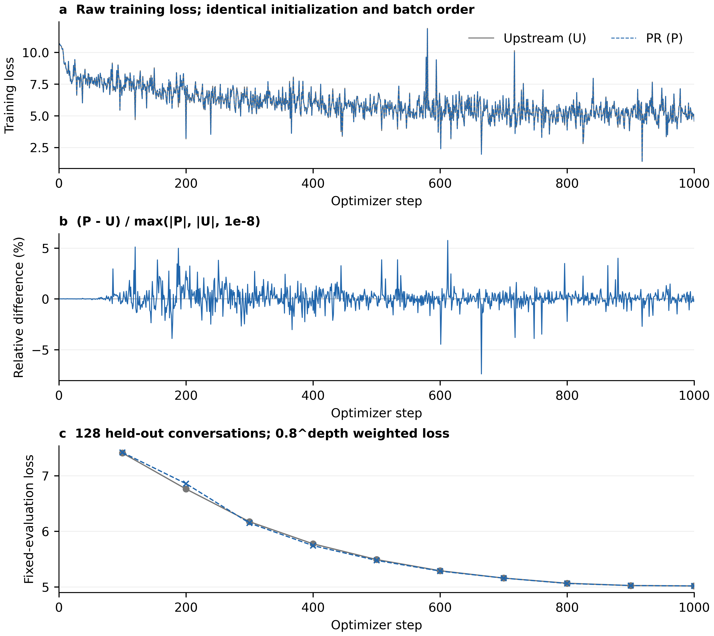

# PR 193 review evidence

## TL;DR

This package compares upstream U with PR P on real ShareGPT-style inputs and 1,000 optimizer steps per arm. The final fixed-evaluation losses are very close (5.018672745 vs 5.018307181), but the stepwise losses are not identical: mean symmetric relative difference 0.5910%, maximum 7.3803%. A one-pair result is not a multi-seed convergence or serving-quality guarantee.

The production implementation retains the all-valid fallback. A scatter-only variant S was benchmarked and not selected. The source PR only adds BF16 test coverage in this review follow-up.

## Contents

- [Training comparison](#training-comparison)
- [Data and timing](#data-and-timing)
- [Numerical and synchronization diagnostics](#numerical-and-synchronization-diagnostics)
- [Reproduction](#reproduction)

## Training comparison

U base: `fc28d35039eaa693c1b3ab0eb1dacbf2db6a4766`. P computation: `db66ff6042e07d698c397d2f0efe6efaedc674b7`. The later BF16-test commit does not change production computation. Qwen3-8B, one-layer EAGLE3 (399,523,840 trainable parameters), BF16, TTT=7, seed=42, batch=1, accumulation=1, maximum length=4096, LR=1e-4, native optimizer warmup/cosine schedule.

The two 1,000-step runs used the same physical GPU sequentially, identical initial parameter/FP32-master hashes, and identical per-step input/mask hashes. Teacher outputs were generated once with the official `torchspec.offline.generate` HF backend. The trajectory runner calls native `Eagle3Trainer.train_from_queue` / `BF16Optimizer` with a deterministic local `OfflineDataset` transport adapter, rather than the online Ray/Mooncake delivery loop. This is a training-consistency check, not a complete online pipeline throughput measurement.

Two independent 50-step U repeats matched every training metric and final parameter/master hash exactly. The formal U run's first 50 steps also matched.

- Mean absolute training-loss difference: 0.034524734.
- Mean symmetric relative difference: 0.5910058%.
- Maximum symmetric relative difference: 7.3803468% at step 665; P was lower at that step.
- 166/1,000 steps exceed 1% relative difference. The existing upstream TP/PP CI 1% criterion is a diagnostic reference, not a passed exactness gate for this PR.
- Maximum per-depth fixed-evaluation relative difference across all ten evaluations: 2.4832684% (intermediate training).
- Final evaluation: U=5.018672745, P=5.018307181, difference relative to U=-0.0072841%; largest final per-depth relative difference=0.0516086%.
- Final parameter hashes differ. Do not describe the trajectories as bitwise equal.

Evaluation uses 128 held-out conversations at every 100 steps. Each depth's loss is weighted by its valid-token count, then depths are combined with normalized weights `0.8**depth`. The plotted training loss is the native Trainer's weighted-average metric. All 1,000 raw steps are shown; no smoothing or outlier removal. There are no inferential confidence intervals: optimizer steps are dependent observations, and there is one long run per arm.

Raw data: [comparison JSON](trajectory-comparison.json), [loss CSV](loss-trajectories.csv), [AA check](aa-comparison.json). The [plot source](plot_trajectories.py), editable SVG and PDF are included. The source checker only warns that there is no TIFF; PNG is the review raster, not a journal submission. Rendered output was inspected for labels, axes, and complete data coverage.

## Data and timing

The 1,000 training batches contain N=1,233,664 padded rows, L=851,536 supervised rows, and V=845,077 supervised rows whose teacher argmax is in the draft vocabulary. Thus L/N=69.02495%, V/L=99.24149%, and V/N=68.50139%. Non-padding rows total 1,169,573. This separates loss-mask sparsity from vocabulary coverage. The held-out set has 95.15972% coverage among supervised rows. See [data provenance](data-provenance.json) and [complete density statistics](real-stats-summary.json).

The real function benchmark uses 12 batch shapes selected at fixed supervised-fraction quantiles, across three independent processes. In each process, arm order rotates; each arm gets 10 warmups and 20 timed calls. P reduces the sum of mean teacher-precompute times across these 12 cases by approximately 14.98%. This is not a population-weighted speedup over all 1,000 samples and not end-to-end training speedup.

The requested high-density synthetic cases were also included (H=1024, V_full=65536, V_draft=32768). At 1950/2048, P is about 0.61% slower than U; at 7800/8192 it is about 0.99% slower. No universal high-density speedup is claimed. Real Qwen3-8B dimensions (H=4096, V_full=151936, V_draft=32000) differ materially; all twelve sampled real cases improved, including the high-density cases.

S and P differ by only +0.047% in aggregate real-case time, while S is consistently approximately 1-2% slower for all-valid synthetic cases. P's all-valid fallback is retained. [Complete timing summary](performance-summary.json).

## Numerical and synchronization diagnostics

A strict probability-element comparison flagged some real BF16 values; these flags are preserved in [real-numerics.json](real-numerics.json). Worst P/U global relative-L2 across the twelve batches is 0.0898607%, while the worst element's absolute probability difference is 0.0211284. P/S probabilities are bit-identical on those real batches, with no P/U target-argmax changes. U and P have comparable error against an independent FP32 projection reference. This is consistent with shape-dependent BF16 projection rounding, not a claim that individual probability elements are identical.

An additional control computes U's dense targets and only zeros unused rows afterward. Its 50-step losses, all training metrics, and final parameter/master hashes match U exactly, supporting the row-selection semantics. The control ran on another GPU of the same model; the main long pair and AA repeats ran on one physical GPU. [Control results](exact-control-comparison.json).

NSYS 2026.4.1, 20 iterations: `.numel()` + the Python comparison issued zero CUDA API calls; deliberately pending GPU work remained pending after every call. The already-existing `nonzero()` and an `.item()` positive control each issued 20 `cudaMemcpyAsync` and 20 `cudaStreamSynchronize` calls. [Trace summary](sync-summary.json), [pending-work observations](sync-probe.json), [probe source](sync_probe.py). Host execution is not zero-cost, but no new synchronization was observed in the `.numel()` scope.

## Reproduction

Use the package versions in [runtime-manifest.json](runtime-manifest.json). Place these scripts in a writable work directory, set `TORCHSPEC_REPO` to a checkout containing the U/P commits, `QWEN3_8B_PATH` to the pinned local model snapshot, `SHAREGPT_DATA` to the matching JSONL corpus, and `PR193_WORK` to the scripts' directory. Add both the checkout and script directory to `PYTHONPATH`. Raw conversations, token IDs, teacher tensors, and model checkpoints are deliberately not published here.

1. `python prepare_data.py` uses TorchSpec's own preprocessing, seed 42 and the corpus SHA above. It selects 1,000 usable training rows plus 128 disjoint evaluation rows without filtering by sparsity.
2. Convert the resulting JSONL files to Parquet with `pyarrow.Table.from_pylist` / `pyarrow.parquet.write_table`. This preserves identical row content/order and exposes the pretokenized schema to the native streaming loader.
3. `python -m torchspec.offline.generate --config "$PR193_WORK/train.yaml" --output "$PR193_WORK/offline"` generates the shared HF teacher cache and vocabulary mapping. Use one permitted GPU and an isolated Ray instance; all runtime changes belong to the environment, not the source PR.
4. `python real_stats.py`; then run `sync_probe.py` under NSYS's cudaProfilerApi capture.
5. `python performance.py 0` (repeat 1 and 2), and `python performance_reviewed.py 0 --real` (repeat 1 and 2). The latter preserves elementwise check failures as flags so timing can be collected; it does not turn those checks into passes. `python real_numerics.py` provides the FP32 comparison.
6. `python trainer_run.py U aa-1 --steps 50 --eval-interval 0 --no-save`, then repeat as `aa-2`. `python trainer_run.py U train-U-1000 --steps 1000`, followed by `python trainer_run.py P train-P-1000 --steps 1000`, on the same GPU. The optional `E exact-control-50` run selects the exact-used-probability control.
7. `python compare_runs.py` and `python plot_trajectories.py` regenerate the tables and figures. Output directories must be new; failed attempts are retained rather than overwritten.

These are one-seed, offline, single-rank experiments. They do not establish distributed equivalence, online throughput, longer-run convergence, or serving acceptance rate.
